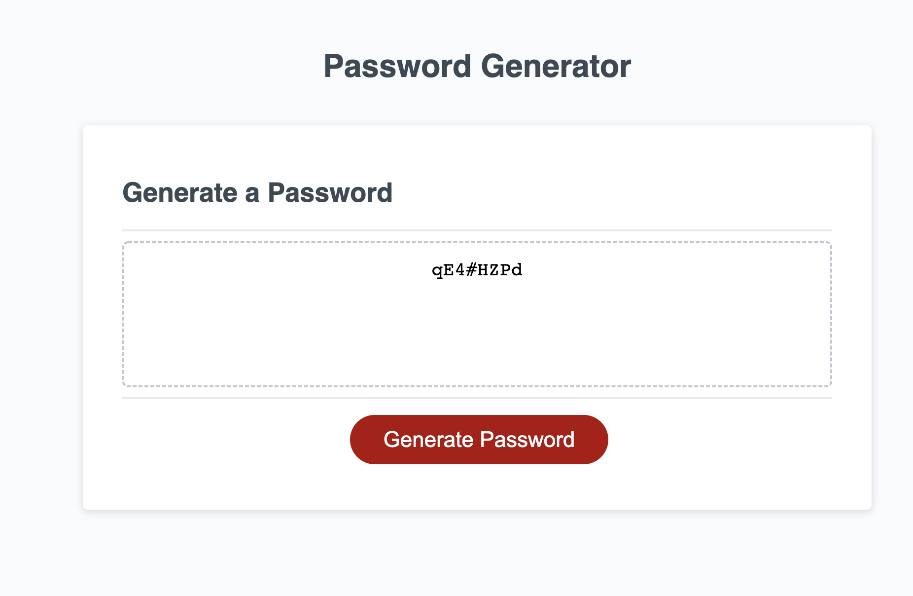

# <PASSWORD-GENERATOR>

## Deployed link to application

## Description

- My motivation for this project was to create a password generator that uses 8-128 characters
- I build this generator to generate a safe password for users
- User are able to have passwords generated with upper case characters, lower case character, numbers, and special characters
- I learned how to create a message if the user is outside of the 8-128 characters

## Usage

Before generating a password the user is prompt with 5 questions about the number of characters, upper case characters, lower case character, numbers, and special characters. Once the user goes through the prompts they are able to generate a safe password.

## Credits

Kalina Boksa
